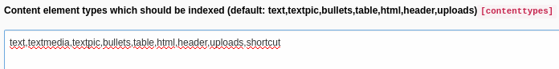

# kesearch_shortcut_indexer

## What is EXT:kesearch_shortcut_indexer?

As the extension key suggests, it is an indexer for shortcut elements with ke_search

## Installation

Just install it the common ways. It hooks up in page-/content-indexer. You can install EXT:kesearch_shortcut_indexer in
TYPO3 CMS using the [TER](https://extensions.typo3.org/extension/kesearch_shortcut_indexer/)
or use composer to fetch EXT:kesearch_shortcut_indexer
from [packagist](https://packagist.org/packages/hziegenhain/kesearch-shortcut-indexer):

```
composer req hziegenhain/kesearch-shortcut-indexer
```

## Documentation / Screenshot

Add 'shortcut' to the list content types, which should be indexed in the indexer config.


## How to contribute?

Just fork this repository and create a pull request to the **master** branch. Please also describe why you've submitted
your patch. If you have any questions feel free to contact me.

## Thanks

This extension is heavily inspired by EXT:mask_kesearch_indexer by Gregor Agnes (zwo3). Thank you very much, Gregor.
